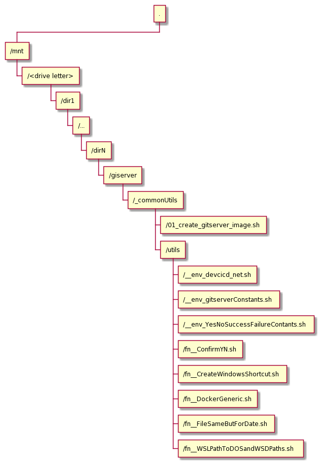

# Git Server Docker Container

<!-- TOC -->

- [Git Server Docker Container](#git-server-docker-container)
  - [Introduction](#introduction)
  - [Assumed host environment](#assumed-host-environment)
  - [Assumed execution environment](#assumed-execution-environment)
  - [Installation](#installation)
  - [Create Git Server Docker Image: 01_create_gitserver_image.sh](#create-git-server-docker-image-01_create_gitserver_imagesh)
    - [Customisation](#customisation)
    - [Script invocation](#script-invocation)
    - [High-level build logic](#high-level-build-logic)
    - [Bill of Materials (of sorts)](#bill-of-materials-of-sorts)
  - [Create and Run Docker Container: 02_create_gitserver_container](#create-and-run-docker-container-02_create_gitserver_container)
    - [Customisation](#customisation-1)
    - [Script invocation](#script-invocation-1)
    - [High-level logic](#high-level-logic)
    - [Extras](#extras)
      - [Windows Shortcuts](#windows-shortcuts)
      - [Host-Guest-Shared "backups" directory](#host-guest-shared-backups-directory)
      - [Custom Git commands accepted by the server over SSH](#custom-git-commands-accepted-by-the-server-over-ssh)
  - [Create Remote Git Repository: 03_create_named_repo_in_private_gitserver.sh](#create-remote-git-repository-03_create_named_repo_in_private_gitserversh)
    - [Customisation](#customisation-2)
    - [Script invocation](#script-invocation-2)
    - [High-level logic](#high-level-logic-1)
  - [Dependencies](#dependencies)
  - [To-Do](#to-do)
  - [Licensing](#licensing)
  - [Note](#note)

<!-- /TOC -->

## Introduction

Scripts in this package facilitate creation of a Docker Image and a Docker Container with a private GIT Server. The image uses the most recent GIT distribution (2.26 at the time of this writing). The container can be used to provide docker-network-wide Git repository for small to medium size teams workng on projects whose sources cannot or should not be stored in cloud-hosted Git repositories. Small to medium start-ups or small companies might be examples.

The image is based on [bitnami/minideb:jessie](https://github.com/bitnami/minideb) image as at early May 2020.

Installing latest Git from sources, and pre-requisites for building Git from sources, blows the image up from about 51MB (`bitnami/minideb:jessie`) to about 778MB during the build process, and then shrinks it back to 238MB once the build is finished and build tools are removed.

The image is saved as the `gitserver:1.0.0` Docker Image and, if the user invokes the script with the correct argument, also uploaded to a remote docker repository, which must be defined (see later).

[Top](#Git-Server-Docker-Container)

## Assumed host environment

- Windows 10
- Docker Desktop for Windows 2.2.0.5
- Windows Subsystem for Linux (WSL)
- git installed in the WSL environment

Scripts (bash) expect to run within the Windows Subsystem for Linux (WSL) Debian host and have access to Windows' docker.exe and docker-compose.exe.

[Top](#Git-Server-Docker-Container)

## Assumed execution environment

The script expects directory structure like:

`/mnt/<drive letter>/dir1/../dirN/<projectNameDir>/_commonUtils/`

Top-level scripts, belonging to this package, are expected to be located in the **\_commonUtils** directory and to have that directory as their working directory at the time of invocation.

The scripts source a number of utility scripts, located in its `utils` subdirectory

The scripts assume that all projects-specific artefacts which are generated, except the docker image and the docker container, will be created in the parent directory of the **\_commonUtils** directory.

<!--
from https://plantuml.com/wbs-diagram
@startwbs
+ .
 + /mnt
  + /<drive letter>
   + /dir1
    + /...
     + /dirN
      + /giserver
       + /_commonUtils
        + /01_create_gitserver_image.sh
        + /utils
         + /__env_devcicd_net.sh
         + /__env_gitserverConstants.sh
         + /__env_YesNoSuccessFailureContants.sh
         + /fn__ConfirmYN.sh
         + /fn__CreateWindowsShortcut.sh
         + /fn__DockerGeneric.sh
         + /fn__FileSameButForDate.sh
         + /fn__WSLPathToDOSandWSDPaths.sh
@endwbs
-->

The following diagram depicts the fictitious directory hierarchy and actual artifacts involved. The name <strong>gitserver</strong> is the 'project' name. The name <strong>\_commonUtils</strong> is the name of the directory in which the main scripts are expected to reside. The <strong>utils</strong> directory contains common constant and function definitions, many of which are used in the main script.

<!--  -->

[Top](#Git-Server-Docker-Container)

## Installation

In a suitable location in the file system create a directory to host the package. You might consider <strong>gitserver</strong>, since scripts in this package will create an image suitable for running a git servere with latest git, and a container based on that image ready for use.

For example (in WSL bash):

`cd <my server's directory's parent>` 
<code>mkdir -pv <strong>gitserver</strong></code> 
<code>cd <strong>gitserver</strong></code>

Then:

<code>git clone https://github.com/mwczapski/private_gitserver_docker_container <strong>\_commonUtils</strong></code>

OR

<code>wget https://github.com/mwczapski/private_gitserver_docker_container/archive/master.zip -O private_gitserver_docker_container.zip</code>

<code>cd <strong>\_commonUtils</strong></code> 
`unzip -j ../private_gitserver_docker_container.zip` 
`git init` 
`git add .` 
`git commit -m "Manual commit after zip unarchive"` 

[Top](#Git-Server-Docker-Container)

## Create Git Server Docker Image: 01_create_gitserver_image.sh

### Customisation

Scripts `__env_devcicd_net.sh`, `__env_gitserverConstants.sh` and `fn__DockerGeneric.sh`, located in the <strong>utils</strong> subdirectory, contain all environment variables that may need to be reviewed and changed to implement site-specific customisations.

Relevant section of the `__env_devcicd_net.sh` is reproduced below. Values that can be changed are highlighted.

<code>
__DEVCICD_NET_DC_INTERNAL=<strong>"devcicd_net"</strong></code>
 
<code>__DEVCICD_SUBNET_ADDRESS=<strong>"172.30.0.0/16"</strong></code>

If the external docker network `docker_devcicd_net` does not exist, it will be created by this script. Note that 'docker\_' is prefixed by the docker-compose to the value defined in `__DEVCICD_NET_DC_INTERNAL`. Consequently, the full name of the network will be `docker_devcicd_net` in this case.

Relevant bits of the `__env_gitserverConstants.sh` are reproduced below. The following variables may need to be changed from the standpoint of externally-visible names and numbers. All other variabkes are either derived from these or are internal.

<code>
__GIT_HOST_PORT=<strong>50022</strong> 
</code>
 
<code>
__GITSERVER_NAME="<strong>gitserver</strong>" 
</code>
<code>
__GITSERVER_HOST_NAME="<strong>gitserver</strong>" 
</code>
<code>
__GITSERVER_CONTAINER_NAME="<strong>gitserver</strong>" 
</code>
</>

The container runs the ssh server to provide remote access to the Git repositories. Port 22 in the container is exposed on port <strong>\_GIT_HOST_PORT\_</strong> of the docker host. Change that as required.

Script `fn__DockerGeneric.sh` contains the definition of the remote docker repository, which will have to be changed if you want to upload the image to a remote repository. If you run the script without arguments that would request remote repository upload then the scrip will skip the related logic and repository name will be ignored. If you need to, change the value of: 

<code>__DOCKER_REPOSITORY_HOST=<strong>"my.docker.repository.net"</strong></code>

[Top](#Git-Server-Docker-Container)

### Script invocation

<code>cd /mnt/\<driver letter\>/dir1/../dirN/gitserver/\_commonUtils</code>

<code>
./01_create_gitserver_image.sh  
</code>

OR

<code>
./01_create_gitserver_image.sh <strong>push|yes|p|y</strong>
</code>

The first variant (no argument or an argument starting with anything other than `Y`, `y`, `P` or `p` will NOT perform tagging and upload of the Docker Image `gitserver:1.0.0` to the configured remote Docker Repository.

The second variant (an argument starting with `Y`, `y`, `P` or `p`) will perform all actions including uploading the Docker Image `gitserver:1.0.0` to the configured remote Docker Repository.

Execution of this script will result in the Dockerfile being generated and used to create the Docker Image.

[Top](#Git-Server-Docker-Container)

### High-level build logic

1. Set environment variables
2. Create `docker-entrypoint.sh`
3. Create `Dockerfile`
4. if (Image Does not exist) OR (`Dockerfile` changed since last time) => Build the Docker Image using the `Dockerfile` from 3
5. if (container that uses the image exists) => stop AND/OR remove the container
6. Create and Start the container
7. Give non-root user's ownership of its home directory and resources
8. Create and deploy custom Git Shell commands (help, list, backup)
9. Commit continer changes to the image
10. Stop the container
11. Tag the image (DockerRemoteRepositoryName/ImageName:Version)
12. if (user requested push to remote docer repository) => Push the image to the defined remote docker repository

[Top](#Git-Server-Docker-Container)

### Bill of Materials (of sorts)

<ol>
<li><code>bitnami/minideb:jessie</code></li>
<li>See output of <code>docker image inspect gitserver</code> once the image is built or inspect the <code>Dockerfile.gitserver</code> in the parent of the <strong>_commonUtils</strong> directory to see what actually went on. 
<li>The build script adds the following to the <code>bitnami/minideb:jessie</code> image:</li>
<ol>
    <li><code>tzdata</code></li>
    <li><code>net-tools</code></li>
    <li><code>iputils-ping</code></li>
    <li><code>openssh-client</code></li>
    <li><code>openssh-server</code></li>
    <li><code>nano</code></li>
    <li><code>less</code></li>
</ol>
<li>The build script adds the following to enable git to be built from sources, then removes them once build is done:</li>
<ol>
    <li><code>wget</code></li>
    <li><code>unzip</code></li>
    <li><code>build-essential</code></li>
    <li><code>libssl-dev</code></li>
    <li><code>libcurl4-openssl-dev</code></li>
    <li><code>libexpat1-dev</code></li>
    <li><code>gettext</code></li>
</ol>
<li>Perhaps needless to say, the build process also adds:</li>
<ol>
    <li><code>git</code></li>
</ol>
</li>
</ol>

[Top](#Git-Server-Docker-Container)

## Create and Run Docker Container: 02_create_gitserver_container

### Customisation

There are no customisable properties / variables that this script uses which would not have already been customised for script `01_create_gitserver_image.sh`. All scripts use the same `__env_devcicd_net.sh`, `__env_gitserverConstants.sh` and `fn__DockerGeneric.sh`, so customisation applied there carry over.

[Top](#Git-Server-Docker-Container)

### Script invocation

cd /mnt/<driver letter>/dir1/../dirN/gitserver/\_commonUtils

`./02_create_gitserver_container.sh`

The script accepts no command line arguments and expects the image produced by `01_create_gitserver_image.sh` to be available.

[Top](#Git-Server-Docker-Container)

### High-level logic

1. Set local environment variables
2. Prompt whether user wants to have Windows Shortcuts created
3. Confirm Artefact location
4. Create docker-compose.yml file
5. If (docker image does not exists) => Pull image from remote repository and abort if can't pull the image
6. If container exists but is not running => start container
7. If container does not exist => create container and start it
8. Start ssh service in the container
9. If user asked for windows shortcuts => create windows shortcuts

[Top](#Git-Server-Docker-Container)

### Extras

#### Windows Shortcuts

As I run Windows Services for Linux a lot, but use Windows Explorer a fair bit, I like to have handy shortcuts that I can use to, for example, get into the container from Explorer.

The 'extras' that you might get, if you choose to have them by responding Y to the appropriate prompt, are a bunch of windows shortcuts that execute specific commands, see table below. Note that 'dcc' stands for `docker.exe container`, 'dco' stands for `docker-compose.exe` and that the docker compose configuration file path is included by the script and is based on the location of the docker-compose.yml_xxxxx file.

<table>
<caption>Windows Shortcuts and commands they execute</caption>
<thead>
<th>Shortcut Name</th>
<th>Command</th>
</thead>
<tbody>
<tr>
<td>dcc exec -itu git gitserver</td>
<td>C:\Windows\System32\cmd.exe /c wsl -d Debian -- bash -lc "docker.exe container exec -itu git --workdir /home/git gitserver /bin/bash -l" || pause</td>
</tr>
<tr>
<td>dcc exec -itu root gitserver</td>
<td>C:\Windows\System32\cmd.exe /c wsl -d Debian -- bash -lc "docker.exe container exec -itu root --workdir / gitserver /bin/bash -l" || pause</td>
</tr>
<tr>
<td>dco gitserver ps</td>
<td>C:\Windows\System32\cmd.exe /c docker-compose.exe -f d:\gitserver\gitserver\docker-compose.yml_gitserver ps gitserver && pause</td>
</tr>
<tr>
<td>dco gitserver rm -s -v</td>
<td>C:\Windows\System32\cmd.exe /c docker-compose.exe -f d:\gitserver\gitserver\docker-compose.yml_gitserver rm -s -v gitserver || pause</td>
</tr>
<tr>
<td>dco gitserver stop</td>
<td>C:\Windows\System32\cmd.exe /c docker-compose.exe -f d:\gitserver\gitserver\docker-compose.yml_gitserver stop gitserver || pause</td>
</tr>
<tr>
<td>dco gitserver up --detach</td>
<td>C:\Windows\System32\cmd.exe /c docker-compose.exe -f d:\gitserver\gitserver\docker-compose.yml_gitserver up --detach gitserver || pause</td>
</tr>
</tbody>
</table>

[Top](#Git-Server-Docker-Container)

#### Host-Guest-Shared "backups" directory

The docker-compose command that creates the dcker container also creates the host directory `"backups"`, at the same level as `_commonUtils`, and mounts it as bound volume in the container.

The "backup" command, available to the user issuing the following command from a client:
<code>ssh git@gitserver backup \<reponame\></code>
will tar up the nominated remote git repository and will deposit the archive in that host directory. Just in case.

[Top](#Git-Server-Docker-Container)

#### Custom Git commands accepted by the server over SSH

<table>
<caption>Custom Git Server commands</caption><header>
<thead>
<tr>
<th>Command invocation</th>
<th>Description</th>
<tr>
</thead>
<tbody>
<tr>
<td>ssh git@gitserver</td>
<td>Will inoke a "no-login" script, present a help text and permit entry of one of the available commands</td>
</tr>
<tr>
<td>ssh git@gitserver help</td>
<td>Will display help text and exit</td>
</tr>
<tr>
<td>ssh git@gitserver backup &lt;git repo name&gt;</td>
<td>Will validate &lt;git repo name&gt;, to ensure the repo exists, and will create a timestamped zip archive of the rpository in the diectory "backups" shared with the host</td>
</tr>
<!-- <tr>
<td></td>
<td></td>
</tr> -->
</tbody>
</table>

[Top](#Git-Server-Docker-Container)

## Create Remote Git Repository: 03_create_named_repo_in_private_gitserver.sh

### Customisation

There are no customisable properties / variables that this script uses which would not have already been customised for script `01_create_gitserver_image.sh`. All scripts use the same `__env_devcicd_net.sh`, `__env_gitserverConstants.sh` and `fn__DockerGeneric.sh`, so customisation applied there carry over.

[Top](#Git-Server-Docker-Container)

### Script invocation

cd /mnt/<driver letter>/dir1/../dirN/gitserver/\_commonUtils

`03_create_named_repo_in_private_gitserver.sh [<Name of New Repository>] [<Path To id_rsa.pub>]`

The script expects the container, produced by `02_create_gitserver_container.sh` to be running.

The script accepts two optional arguments.

<table>
<caption>Script Arguments</caption><header>
<thead>
<tr>
<th>Argument</th>
<th>Description</th>
<th>Default</th>
<tr>
</thead>
<tbody>
<tr>
<td style="vertical-align: top;">&lt;Name of New Repository&gt;</td>
<td>Optional. The name of the new remote repository. If the repository already exists the script will abort with a note to that effect. 
If the repository does not exist it will be created as a "bare" repository.
</td>
<td style="vertical-align: top;">gittest</td>
</tr>
<tr>
<td style="vertical-align: top;">&lt;Path To id_rsa.pub&gt;</td>
<td>Optional. The script needs to connect to the remote repository using ssh. To accomplish this the git server needs to "know" the client. Providing the path to the client's id_rsa.pub will enable the script to add the public key to the server's authorised_keys store and then add the repository. As a side-effect the client will be able to invoke custom commands the git server offers, for example <code>ssh git@gitserver list</code> or <code>ssh git@localhost -p 50022 list</code> if using WSL in windows on which the docker is installed.</td>
<td style="vertical-align: top;">~/.ssh/id_rsa.pub</td>
</tr>
</tbody>
</table>

[Top](#Git-Server-Docker-Container)

### High-level logic

1. Get repository name and id_rsa.pub path from the command line, or substitiute defaults.
2. Add id_rsa.pub to git server's authorised_hosts store
3. Determine whether repository already exists and abort if it does or if the existence cannot be established
4. Create a `--bare` repository with the specified name

[Top](#Git-Server-Docker-Container)

## Dependencies

This scripts have hard dependencies on a number of constants and functions whose sources are in the `_commonUtils/utils` directory. Specifically:

1. \_\_env_devcicd_net.sh
2. \_\_env_gitserverConstants.sh
3. \_\_env_YesNoSuccessFailureContants.sh
4. fn\_\_WSLPathToDOSandWSDPaths.sh
5. fn\_\_ConfirmYN.sh
6. fn\_\_DockerGeneric.sh
7. fn\_\_FileSameButForDate.sh
8. fn\_\_CreateWindowsShortcut.sh

[Top](#Git-Server-Docker-Container)

## To-Do

<ol>
<li>Better customisation experience (externally-defined customisation variables AND/OR configuration script)</li>
<li>Add "Create a remote repository" functionality</li>
<li>Add automatic repository backup on push functionality</li>
<li>Add recover repository from selected backup functionality</li>
</ol>

[Top](#Git-Server-Docker-Container)

## Licensing

The MIT License (MIT)

Copyright © 2020 Michael Czapski

Rights to Docker (and related), Git (and related), Debian, its pakages and libraries, and 3rd party packages and libraries, belong to their respective owners.

[Top](#Git-Server-Docker-Container)

## Note

[Top](#Git-Server-Docker-Container)

If you would like me to consider working for you, working with you on an interesting project, or engaging in specific projects for you, feel free to contact me.

[Top](#Git-Server-Docker-Container)

2020/05 MCz
